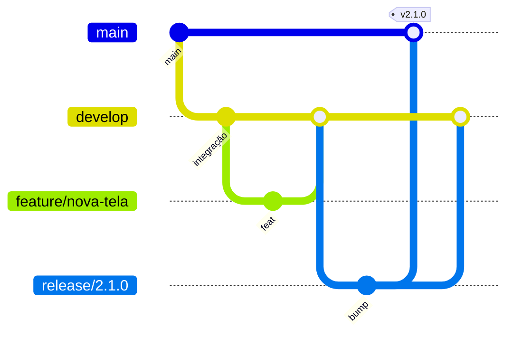

# Gitflow — Pontuação Conclave

Modelo de branches adotado neste repositório.

## Branches permanentes

| Branch    | Papel                                                               |
| --------- | ------------------------------------------------------------------- |
| `main`    | Produção estável; cada merge aqui pode gerar tag e deploy no Pages. |
| `develop` | Integração contínua; base para features e releases.                 |

## Branches temporárias

| Prefixo    | Origem    | Destino            | Uso                                     |
| ---------- | --------- | ------------------ | --------------------------------------- |
| `feature/` | `develop` | `develop`          | Novas funcionalidades e melhorias.      |
| `release/` | `develop` | `main` + `develop` | Estabilização antes de publicar versão. |
| `hotfix/`  | `main`    | `main` + `develop` | Correção urgente em produção.           |

Exemplos: `feature/podium-export`, `release/2.1.0`, `hotfix/corrige-desempate`.

## Fluxo resumido



### Feature

```bash
git checkout develop
git pull origin develop
git checkout -b feature/minha-mudanca
# … commits …
git push -u origin feature/minha-mudanca
# Abrir PR → develop
```

### Release

```bash
git checkout develop
git pull origin develop
git checkout -b release/2.1.0
# Bump version em package.json, CHANGELOG.md; smoke tests
git push -u origin release/2.1.0
# PR release/2.1.0 → main (merge + tag v2.1.0)
# Depois merge release/2.1.0 → develop
```

### Hotfix

```bash
git checkout main
git pull origin main
git checkout -b hotfix/descricao-curta
# … fix …
git push -u origin hotfix/descricao-curta
# PR hotfix → main (merge + tag se aplicável)
# Depois merge hotfix → develop
```

## CI e deploy

- **CI** (`ci.yml`, Lighthouse): push em `main` ou `develop`; PRs para `main` ou `develop`.
- **GitHub Pages** (`pages.yml`): apenas push em `main` (produção).

## Configuração local (opcional)

Se tiver [git-flow](https://github.com/nvie/gitflow) instalado:

```bash
git flow init -d
```

Os prefixos padrão já coincidem (`feature/`, `release/`, `hotfix/`). Branch de produção:
`main`; branch de desenvolvimento: `develop`.

Sem a extensão, use os comandos manuais acima — o fluxo é o mesmo.
