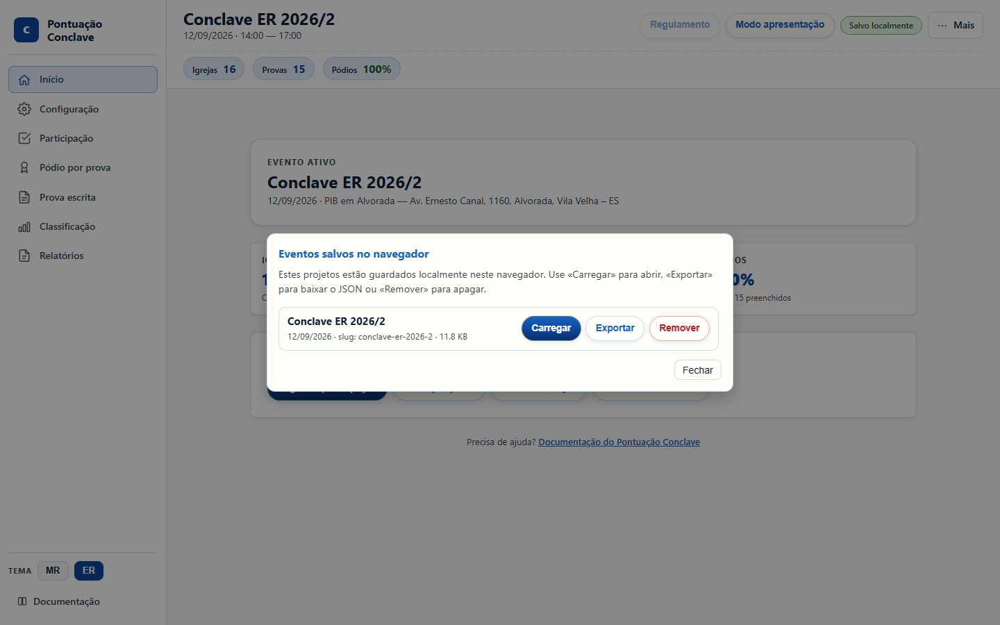
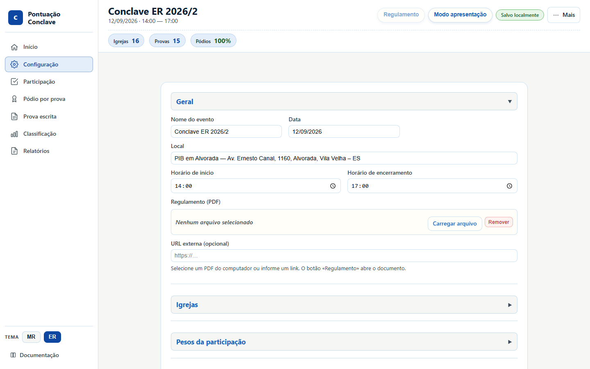
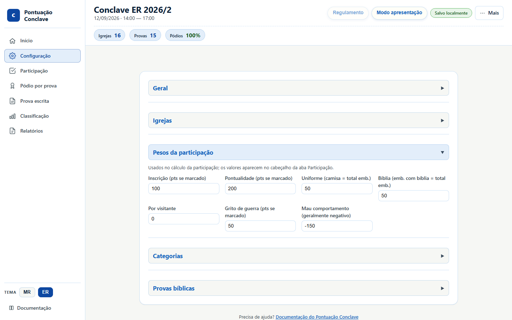
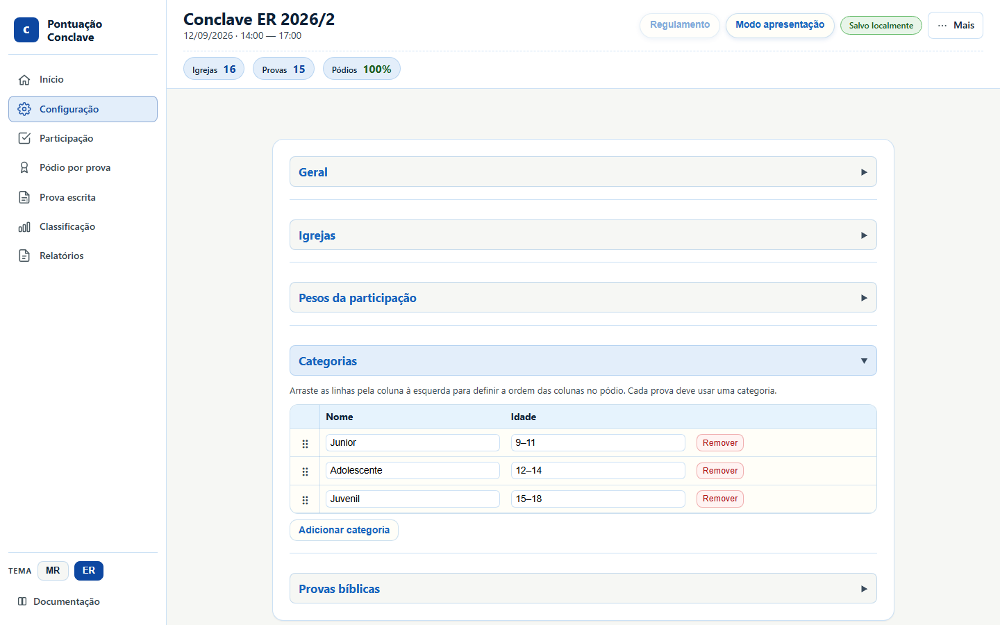
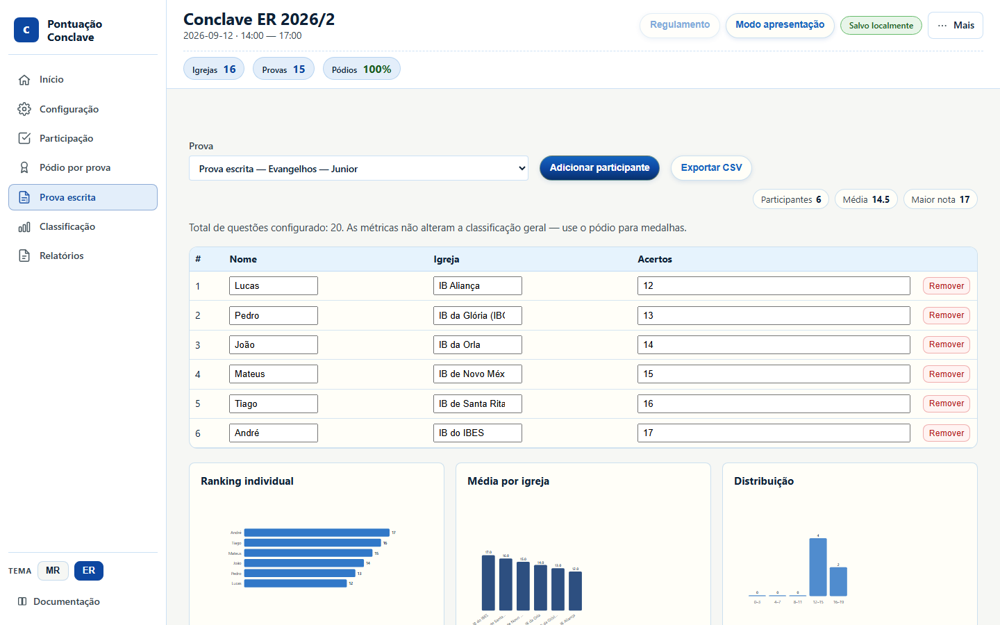
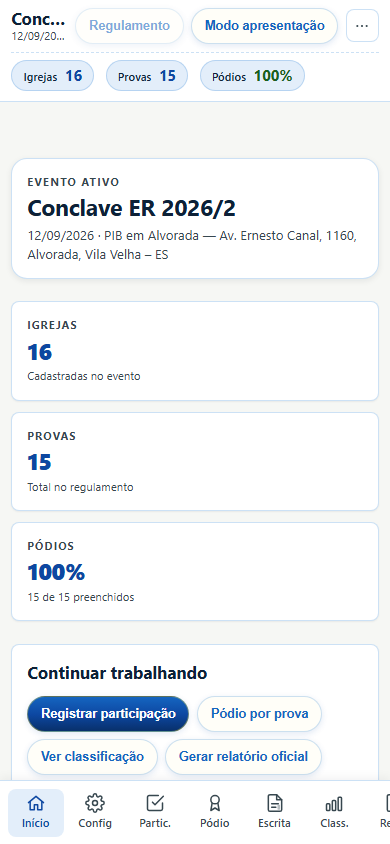

# Guia visual do Pontuação Conclave

Tour ilustrado de **todas as telas** do app, com capturas geradas pelo Playwright a partir do evento **Conclave ER 2026/2**. Os números nas telas são de demonstração — no dia do evento você lança os dados reais.

Para aprender o fluxo em 5 minutos, use o [tutorial rápido](tutorial-5min.md).

Para regenerar as imagens:

```
npm run guia:visual
npm run build:docs
```

## Sumário

- [Início (dashboard)](#inicio-dashboard)
- [Menu Mais](#menu-mais)
- [Eventos salvos](#eventos-salvos)
- [Configuração](#configuracao)
- [Participação](#participacao)
- [Pódio por prova](#podio-por-prova)
- [Prova escrita](#prova-escrita)
- [Esgrima](#esgrima)
- [Classificação](#classificacao)
- [Relatórios](#relatorios)
- [Modo apresentação](#modo-apresentacao)
- [Celular](#celular)

## Início (dashboard)

Primeira aba. Mostra o evento ativo (nome, data, local), atalhos para Participação, Pódio, Classificação e Relatório, e a lista de projetos guardados neste navegador.


A **sidebar** (à esquerda no desktop) lista as oito abas, o seletor de tema **MR / ER** (só troca as cores) e o link da documentação.

## Menu Mais

No canto superior direito. Agrupa carregar/exportar evento e projeto, novo evento, eventos salvos e limpar dados. **Modo apresentação** e **Regulamento** ficam na topbar, fora deste menu.


- **Carregar evento** — só a configuração (`.evento.json`).
- **Carregar projeto** — configuração + dados lançados (`.projeto.json`).
- **Exportar evento / projeto** — backup. Exporte o projeto cedo no dia do evento.
- **Limpar dados** — zera participação e pódio, mantém igrejas e provas.

## Eventos salvos

Projetos neste navegador (`localStorage`). Dá para carregar, exportar ou remover. O Conclave MR 2026/1 pode aparecer aqui se você já o usou — no dia do ER, deixe o **Conclave ER 2026/2** como evento ativo.



## Configuração

Cadastro do evento. Seções recolhíveis: Geral, Igrejas, Pesos, Categorias e Provas.

### Geral

Nome, data, local, horários e PDF do regulamento (botão **Regulamento** na topbar).



### Igrejas

Uma linha por igreja. Dá para adicionar em lote (um nome por linha). Remover uma igreja apaga a linha na Participação e as medalhas dela no pódio.


### Pesos e medalhas

No ER 2026/2: inscrição 100, pontualidade 200, uniforme/bíblia 50, grito de guerra 50, mau comportamento −150, visitantes 0. Medalhas 300 / 200 / 100. **Não clique no tema ER para “aplicar preset”** — o tema agora é só visual.



### Categorias

Faixas etárias do regulamento. No ER 2026/2: Junior 9–11, Adolescente 12–14 e Juvenil 15–18. Cada prova é lançada por categoria.



### Provas

15 provas (Evangelhos, Organização, Montagem, Esgrima e Debate × Junior / Adolescente / Juvenil). Tipo **escrita** (Evangelhos, Organização e Montagem) alimenta a aba Prova escrita; tipo **oral** (Esgrima e Debate) só entra no pódio.


## Participação

Uma linha por igreja. No tema ER as colunas são:

- **Inscr.** — inscrição até o prazo (100 pts).
- **Pont.** — pontualidade no evento (200 pts).
- **Presentes / Camisa / Bíblia** — uniforme e Bíblia só pontuam se a contagem for igual ao total de presentes. Não inclua visitantes nesses números.
- **Grito** — grito de guerra (50 pts).
- **Mau comp.** — conversa/saídas (−150 pts naquela igreja).
- **Extra** — CER no pré-conclave (+100) + pastor presente (+50). Se houver penalidade de conservação do templo, subtraia 100 de **todas** as igrejas.

Se inscrição estiver desmarcada **e** Presentes = 0, a linha inteira de participação zera.


## Pódio por prova

Ouro, prata e bronze por prova. Digite a igreja (lista automática) e, se quiser, o nome do competidor. Filtros no topo: categoria, busca, avisos, desempate. As medalhas somam na classificação geral.


## Prova escrita

Cadastro de **acertos por participante** nas provas do tipo escrita. Serve para gráficos e CSV. **Não altera** a classificação — a medalha continua sendo lançada no Pódio. Mínimo do regulamento ER: 12 acertos em 20 (60%) para pontuar medalha.



## Esgrima

Sorteio de referências para o líder da **Esgrima (Debate Bíblico)** ditar, sem repetir na mesma categoria. Cronômetro 20 s (MR) ou 30 s (ER). **Não altera** a classificação — medalhas continuam no Pódio. Debate de versículos e Esgrima avançada não usam esta aba.

## Classificação

Ranking geral: participação + punições + medalhas + extra. Desempate no ER: ouro → prata → Debate de Versículos → Conhecimentos gerais da Organização → nome. A prova de Evangelhos conta medalhas, mas não entra sozinha no critério de desempate. Use **Exportar CSV** para planilha.


## Relatórios

**Resumo** (capa, top 3, pódio, encerramento) para divulgação. **Oficial completo** inclui participação, classificação e critérios para arquivo. Gere e use a impressão do navegador (Salvar como PDF).


## Modo apresentação

Tela cheia para projetor, com cerimônia de revelação do 5.º ao 1.º lugar. Clique ou use as setas para avançar. **Esc** sai. A classificação fica congelada até a cerimônia terminar.


## Celular

Abaixo de 768 px a navegação vai para a **barra inferior**. As mesmas oito abas. Prefira um notebook no dia do evento; o celular serve para consulta.



## Backup no dia do evento

1. Abra o app (tema azul ER, evento ER 2026/2).
2. Lance Participação e Pódio.
3. **Mais → Exportar projeto** várias vezes (pen-drive + nuvem).
4. Não clique no tema ER esperando mudar pesos — ele só muda as cores.
