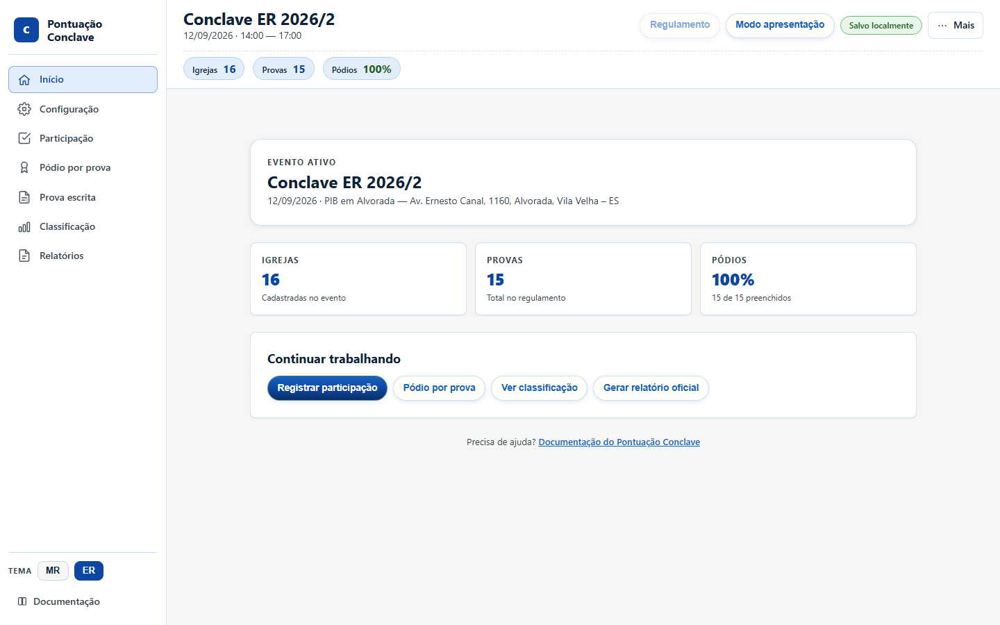
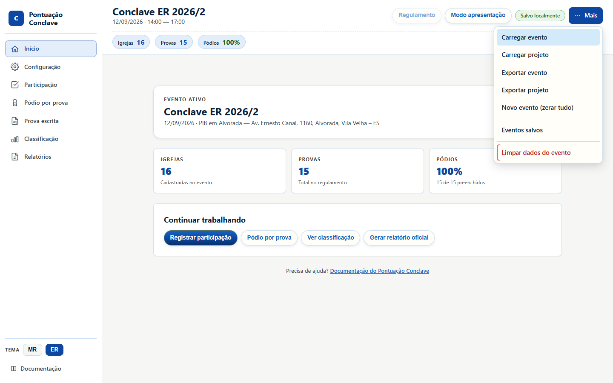
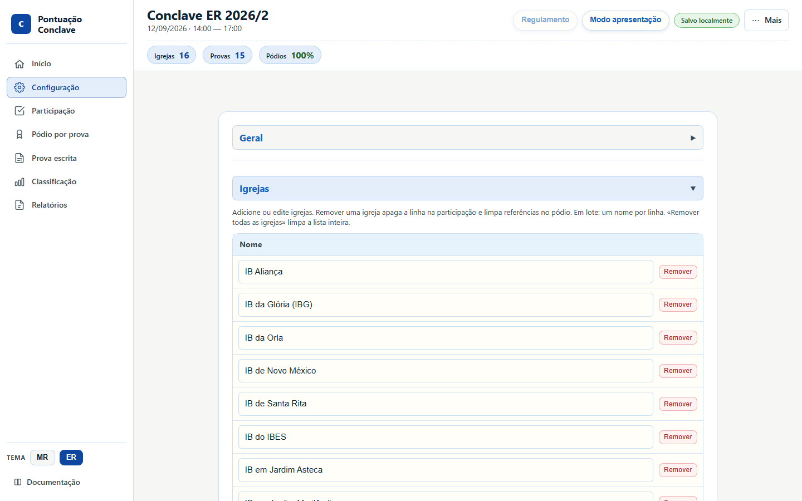
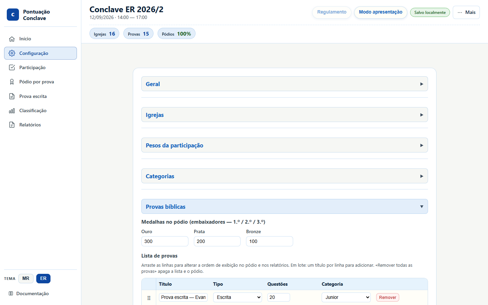
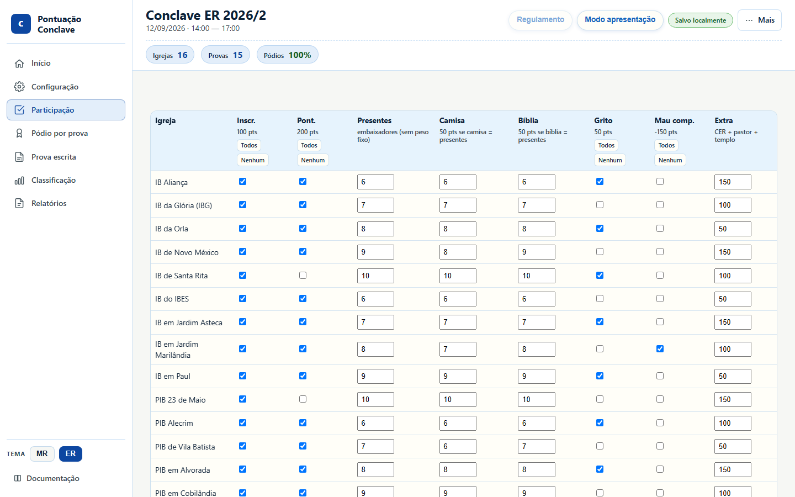
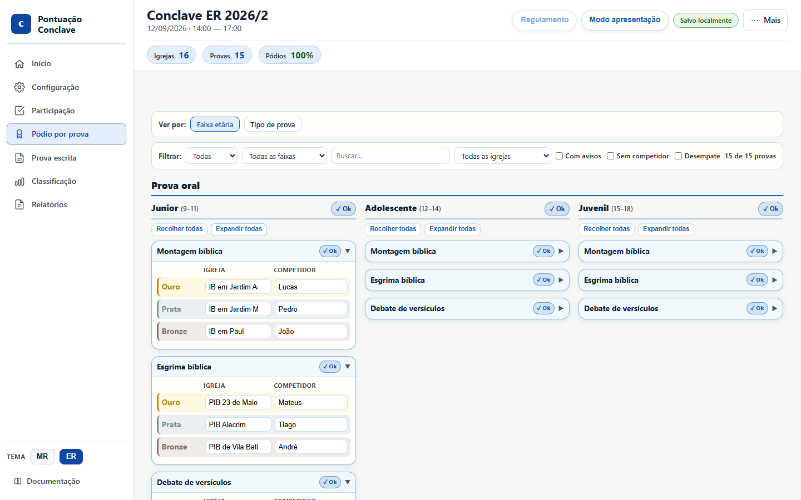
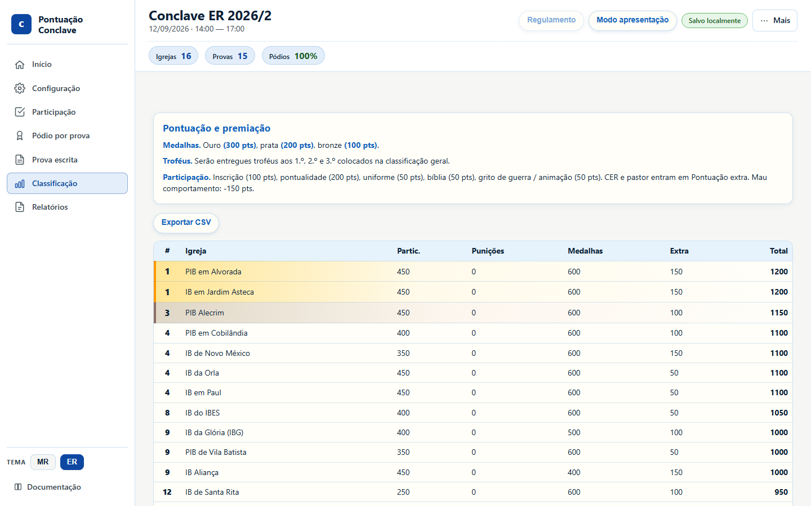
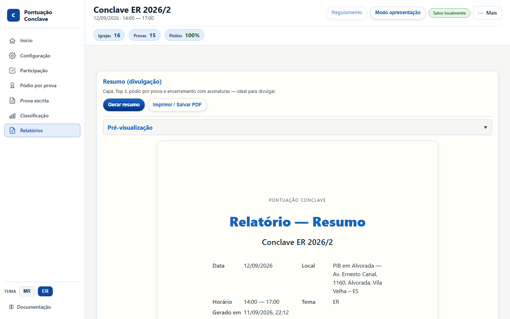
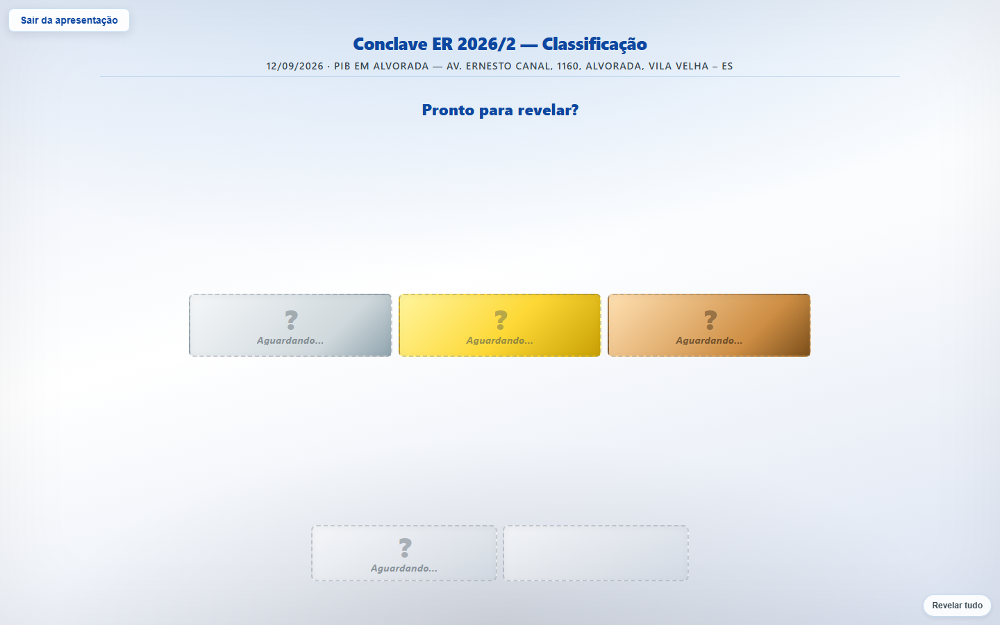

# Tutorial de 5 minutos

No app, clique em **Tutorial na tela** (Início ou rodapé). O guia destaca cada
área, troca de aba e deixa você preencher participação e pódio de verdade.

Esta página é a versão ilustrada, para acompanhar com capturas.

Abra o [app](../../index.html) em outra aba se quiser só ler. Melhor treino: na
aba **Início**, clique em **Carregar exemplo** (o tutorial guiado também faz
isso se ainda não houver evento).

> No dia do evento use um notebook. O celular serve para consultar, não para
> lançar a apuração.

## Mapa das abas

- **Início** — resumo do evento e atalhos.
- **Configuração** — igrejas, provas e pesos. No evento oficial já vem pronta.
- **Participação** — pontos de cada igreja (inscrição, pontualidade, uniforme).
- **Pódio por prova** — ouro, prata e bronze. É o que soma medalha no ranking.
- **Prova escrita** — acertos individuais. Opcional; **não altera** a classificação.
- **Classificação** — ranking automático com desempate.
- **Relatórios** — PDF de divulgação ou arquivo oficial.

A coluna da esquerda (no celular, a barra de baixo) é o mapa inteiro do sistema. O seletor
**MR / ER** só troca as cores. Os pontos vêm do evento carregado, não do tema.

## Minuto 1 — Abra o evento

Três caminhos na aba **Início**:

1. **Carregar exemplo** — treino imediato com o Conclave ER 2026/2.
2. **Carregar projeto** — retoma um arquivo `.projeto.json` (configuração + dados).
3. **Novo evento** — só se for montar do zero. Aí o minuto 2 vira cadastro.

Confira o nome no topo. O selo **Salvo localmente** indica que este navegador
já está guardando sozinho.

O menu **Mais** concentra arquivo: carregar, exportar, eventos salvos e limpar
dados. **Modo apresentação** e **Regulamento** ficam na barra de cima, fora do
menu.

> Exporte **projeto** (não só evento). O projeto leva participação e pódio;
> o evento leva só a configuração vazia.

## Minuto 2 — Confira igrejas e provas

Se o exemplo ou o evento oficial já está aberto, **não recadastre nada**. Abra
**Configuração**, confira a lista de igrejas e a lista de provas, e siga.

Só mexa aqui se faltar igreja, se o nome estiver errado ou se você criou um
evento novo. Dá para colar vários nomes de uma vez (um por linha).

Cada prova tem categoria (Junior, Adolescente, Juvenil) e tipo. Tipo **escrita**
alimenta a aba Prova escrita; tipo **oral** entra só no pódio.

## Minuto 3 — Lance a Participação

Uma linha por igreja. O total à direita atualiza na hora.

O que cada coluna faz no ER:

- **Inscr.** — inscrição no prazo.
- **Pont.** — chegou no horário do evento.
- **Presentes / Camisa / Bíblia** — uniforme e Bíblia só pontuam se o número for
  **igual** aos presentes. Não some visitantes nesses campos.
- **Grito** — grito de guerra.
- **Mau comp.** — penalidade daquela igreja.
- **Extra** — CER no pré-conclave e pastor presente. Penalidade de conservação
  do templo, se houver, entra subtraindo de **todas** as igrejas.

Se inscrição estiver desmarcada **e** Presentes = 0, a linha inteira zera.

## Minuto 4 — Lance o Pódio

Para cada prova, escolha a igreja do ouro, da prata e do bronze. A lista de
igrejas aparece sozinha. O nome do competidor é opcional.

Use os filtros no topo (faixa etária, tipo, busca) quando a lista crescer. O
selo **Ok** na categoria indica que os três lugares daquela prova estão
preenchidos.

A medalha lançada aqui é o que entra na classificação geral.

> A aba **Prova escrita** registra acertos para gráfico e CSV. Ela **não**
> substitui o pódio. Sem ouro/prata/bronze no Pódio, a igreja não soma medalha.

## Minuto 5 — Ranking, backup e palco

A classificação soma participação + punições + medalhas + extra e desempatam
sozinhas (ouro → prata → provas-chave → nome).

**Exportar CSV** gera planilha. Antes de projetar ou encerrar, faça o backup
de verdade: **Mais → Exportar projeto** (pen-drive e nuvem). Só o `.projeto.json`
abre em outro computador.

Em **Relatórios**, gere o **Resumo** (divulgação) ou o **Oficial completo**
(arquivo). Use a impressão do navegador e escolha Salvar como PDF.

**Modo apresentação** (barra de cima) é o projetor: revelação do 5.º ao 1.º
lugar. Clique ou use as setas. **Esc** sai. A classificação fica congelada até
a cerimônia terminar.

## Folha de cola

- **Tema MR/ER** troca cor, não peso.
- **Pódio** pontua. **Prova escrita** só documenta acertos.
- Backup = **Exportar projeto**. Evento sozinho não leva o lançamento.
- Os dados ficam neste navegador até você exportar. Trocar de Chrome para
  Firefox, ou abrir anônimo, parece “perda” de dados.
- Prefira notebook no dia do evento.

Pronto. No dia, o fluxo cabe em uma frase: **Participação → Pódio → Classificação
→ Exportar projeto**.

Quer o tour de todas as telas? Vá ao [guia visual](guia-visual.md). Detalhes
de cada campo estão no [manual de uso](manual-uso.md).
